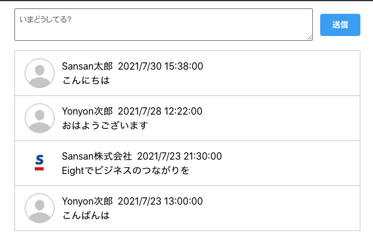

# Example

## 概要

- timeline.v3.yml から生成されたコードを利用したAPI通信のサンプルです。
- YAMLに基づいたスキーマが定義され、モックサーバのレスポンスに応じた正規化が実行されます。

## 使い方
それぞれ**リポジトリのルートディレクトリ**で実行します。

### API定義確認
docker環境が必要となります。
```bash
yarn example:api
# ブラウザでhttp://localhostを開きます
```

### サンプル起動

```bash
yarn example
# 自動でブラウザが起動します
```

## サンプル内容
シンプルなタイムラインです。以下の動作ができます。
- 投稿一覧の表示
- 投稿の作成
- 投稿の削除



### 仕掛け
以下の内容を実施しています。
1. 本リポジトリで作成したツールを使って、timeline.v3.ymlからコードを生成  
   `config/config.schemas.js` に従って、 `src/autoGen` に出力されます。
2. `initial_db.json` にもとづいて、モックサーバを起動します。
3. `yarn start` を実行して、CRAベースのアプリケーションを起動します。  
   このアプリケーションが `1` の生成されたコードを利用して通信およびデータの正規化を行います。
